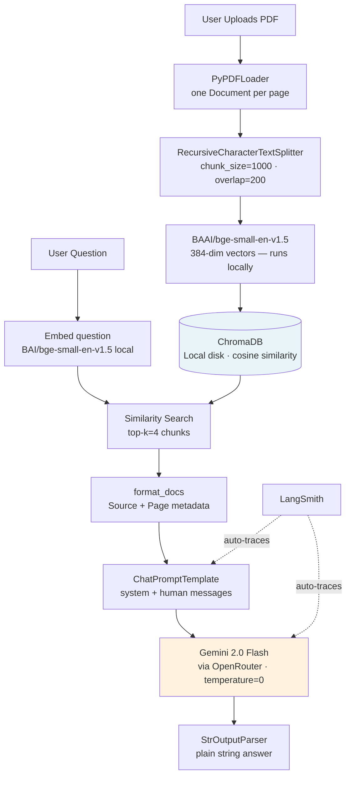

# RAG Chatbot — LangChain + ChromaDB + HuggingFace + OpenRouter

> End-to-end PDF Q&A chatbot: upload any document, ask questions, get answers grounded in the source — not hallucinated. Built with LangChain 0.3 LCEL, ChromaDB, local HuggingFace embeddings, and Gemini 2.0 Flash via OpenRouter. **100% free to run.**


---

## Recent Changes

| Date | Change | Reason |
|------|--------|--------|
| May 2026 | Switched embeddings from `text-embedding-004` → `BAAI/bge-small-en-v1.5` (HuggingFace, local) | `langchain-google-genai==2.0.4` uses deprecated `v1beta` API path; embedding endpoint returns 404 |
| May 2026 | Added OpenRouter as primary LLM provider (`OPENROUTER_API_KEY`) | Google free-tier hits daily quota quickly; OpenRouter routes to same Gemini model with no daily cap |
| May 2026 | Added FastAPI REST wrapper (`src/api.py`) | Portfolio UI needs REST endpoints — Streamlit UI still works alongside |
| May 2026 | Updated `retriever.get_relevant_documents()` → `retriever.invoke()` | `get_relevant_documents()` removed in LangChain 0.3+ |
| May 2026 | Added `langchain-huggingface` + `sentence-transformers` to `requirements.txt` | New embedding dependency |

---

## Skills Demonstrated

| Category | Technologies |
|----------|-------------|
| **RAG Architecture** | PDF ingestion, text chunking, vector embeddings, semantic retrieval, context injection |
| **LLM Frameworks** | LangChain 0.3 LCEL (`\|` pipe operator), `ChatPromptTemplate`, `StrOutputParser` |
| **Vector Search** | ChromaDB, cosine similarity, top-k retrieval, metadata preservation |
| **Local Embeddings** | BAAI/bge-small-en-v1.5 via HuggingFace — 384-dim, runs on CPU, no API key required |
| **Provider Agnostic LLM** | `get_llm()` factory: OpenRouter first, falls back to direct Gemini |
| **REST API** | FastAPI with session management, `python-multipart` file upload, CORS |
| **Observability** | LangSmith tracing (automatic via env var), per-question trace inspection |
| **UI** | Streamlit with `st.session_state` for chain persistence across reruns |
| **Testing** | pytest, `unittest.mock.MagicMock` to mock LLM/vectorstore without API calls |
| **Engineering** | Type hints, module-level logging, `RecursiveCharacterTextSplitter` tuning |

---

## What This Builds

**The Problem:** LLMs hallucinate. If you ask Gemini "What were our Q3 revenue figures?" it will confidently answer from training data — which doesn't contain your internal documents. You need a system that retrieves facts *from your document* before generating an answer.

**The Solution:** RAG (Retrieval-Augmented Generation). Index the document into a vector store at load time. At query time, retrieve only the most relevant chunks and inject them as context. The LLM can only answer from what you gave it.

**The Outcome:** A chatbot that works on *any* PDF. Upload once, ask unlimited questions, with every response cited back to the source pages. Available as both a Streamlit app and a FastAPI REST API.

---

## Architecture



**Indexing phase** (runs once per PDF): load → chunk → embed locally → store  
**Query phase** (runs per question): embed locally → retrieve → inject → generate via OpenRouter

---

## How It Works

### Step 1 — PDF Loading and Chunking (`src/ingestion.py`)

```python
splitter = RecursiveCharacterTextSplitter(
    chunk_size=1000,
    chunk_overlap=200,
    separators=["\n\n", "\n", ".", " ", ""],
)
chunks = splitter.split_documents(documents)
```

`RecursiveCharacterTextSplitter` tries paragraph breaks first, then newlines, then sentences, then spaces. This respects document structure and avoids splitting a sentence mid-word. The `chunk_overlap=200` creates a 200-character window shared between adjacent chunks — so a fact split across a boundary still appears in at least one complete chunk.

**Why 1000/200?** Technical documents average 5-7 sentences per paragraph at ~150 chars/sentence. 1000 chars ≈ 1-2 paragraphs — enough context for the LLM, small enough that retrieved chunks are focused. Validated by RAGAS context_precision scores in Project 2.

### Step 2 — Embedding and Storage (`src/ingestion.py`)

```python
from langchain_huggingface import HuggingFaceEmbeddings

embeddings = HuggingFaceEmbeddings(model_name="BAAI/bge-small-en-v1.5")
vectorstore = Chroma.from_documents(chunks, embedding=embeddings, persist_directory="./chroma_db")
```

`BAAI/bge-small-en-v1.5` converts each chunk to a 384-dimensional float vector. It runs entirely locally via `sentence-transformers` — no API key, no quota, no network call after the initial model download (~90MB, cached). ChromaDB stores both the vector and the original text, persisted to disk so re-uploads aren't needed.

**Key constraint:** the *same* embedding model must be used for both indexing and querying. Mixing models produces incompatible vector spaces and garbage retrieval.

### Step 3 — Provider-Agnostic LLM (`src/utils.py`)

```python
def get_llm(temperature: float = 0):
    if openrouter_key := os.getenv("OPENROUTER_API_KEY"):
        return ChatOpenAI(
            model="google/gemini-2.0-flash-001",
            openai_api_key=openrouter_key,
            openai_api_base="https://openrouter.ai/api/v1",
            temperature=temperature,
        )
    return ChatGoogleGenerativeAI(model="gemini-2.0-flash", temperature=temperature)
```

OpenRouter is checked first — it exposes Gemini via an OpenAI-compatible endpoint with no daily quota cap. Falls back to direct Gemini if only `GOOGLE_API_KEY` is present.

### Step 4 — RAG Chain with LCEL (`src/chain.py`)

```python
chain = (
    {
        "context": retriever | format_docs,
        "question": RunnablePassthrough(),
    }
    | prompt
    | llm
    | StrOutputParser()
)
```

LCEL (LangChain Expression Language) composes the pipeline with the `|` operator. The dict branch runs in parallel: `retriever | format_docs` fetches and formats the top-4 chunks while `RunnablePassthrough()` passes the question through unchanged. LangSmith automatically traces every step when `LANGCHAIN_TRACING_V2=true` is set — no code changes needed.

### Step 5 — System Prompt Design

```python
SYSTEM_PROMPT = """You are a helpful assistant that answers questions based ONLY on the provided context.
Rules:
- Only answer from the given context. Never make up information.
- If the context doesn't contain the answer, say "I don't have enough information in the document to answer this."
- Always cite which part of the document your answer comes from."""
```

The `ONLY` constraint is the most important line. Without it, the LLM blends context with training knowledge — increasing recall but tanking faithfulness scores. RAGAS evaluation (Project 2) confirmed this prompt reduces hallucinations.

---

## Key Engineering Decisions

| Decision | Choice | Alternative Considered | Why This Choice |
|----------|--------|----------------------|-----------------|
| Chunk size | 1000 chars / 200 overlap | 500 chars, 2000 chars | 1000 balances context richness vs retrieval precision. Validated with RAGAS. |
| Embedding model | BAAI/bge-small-en-v1.5 (local) | Google text-embedding-004 | text-embedding-004 returns 404 via deprecated `v1beta` SDK path. HuggingFace has no quota or API key requirement. |
| LLM provider | OpenRouter (primary) + direct Gemini (fallback) | Single provider | Google free tier exhausts at ~60 req/day. OpenRouter routes the same model with no daily cap. |
| Vector store | ChromaDB (local) | Pinecone, FAISS | Zero setup for a portfolio demo. Pinecone used in Project 3. |
| LLM temperature | 0 | 0.3, 0.7 | Factual Q&A requires deterministic answers. Temperature > 0 introduces variance. |
| Chain syntax | LCEL `\|` operator | Legacy `LLMChain` | LCEL is the current LangChain standard, auto-compatible with LangSmith tracing |
| Retrieval top-k | 4 | 2, 8 | 4 gives enough context without overwhelming the prompt. Tune based on doc density. |
| Session state | `st.session_state` / FastAPI dict | Re-building chain per request | Chain/vectorstore init takes 2-5s. Caching persists them across requests. |

---

## Tech Stack

| Component | Technology | Version | Why |
|-----------|-----------|---------|-----|
| LLM | Gemini 2.0 Flash via OpenRouter | `langchain-openai` | No daily quota cap; OpenAI-compatible endpoint |
| Embeddings | BAAI/bge-small-en-v1.5 | `langchain-huggingface` | Local inference — no API key, no quota. 384-dim. |
| Vector Store | ChromaDB | 0.5.18 | Local persistence, no cloud account needed for dev |
| RAG Framework | LangChain 0.3 | LCEL | Industry standard, LCEL composability, auto LangSmith integration |
| REST API | FastAPI + uvicorn | ≥0.115.0 | Async, auto OpenAPI docs, CORS middleware |
| UI | Streamlit | 1.40.1 | Fastest path from Python to interactive web app |
| Tracing | LangSmith | 0.1.147 | Free developer tier, per-step trace visualization, prompt debugging |
| PDF Parsing | PyPDF | 5.1.0 | Lightweight, handles most PDF formats |
| Testing | pytest + MagicMock | 8.3.4 | Mock API calls so tests run without spending API quota |

---

## Quick Start

```bash
git clone https://github.com/themoizqureshi/rag-chatbot-langchain
cd rag-chatbot-langchain

cp .env.example .env
# Add OPENROUTER_API_KEY (recommended) or GOOGLE_API_KEY
# No embedding API key needed — embeddings run locally via HuggingFace

uv venv && source .venv/bin/activate
uv pip install -r requirements.txt
# Note: first run downloads BAAI/bge-small-en-v1.5 (~90MB) — cached after that

# Option A — Streamlit UI
streamlit run app.py
# Opens at http://localhost:8501

# Option B — FastAPI REST API
uvicorn src.api:app --reload --port 8001
# Docs at http://localhost:8001/docs
# POST /ingest  → upload PDF, get session_id
# POST /chat    → { session_id, question } → { answer, sources }
```

Upload any PDF → ask questions in the chat input.

## Running Tests

```bash
pytest tests/ -v                      # all tests
pytest tests/test_ingestion.py -v     # ingestion only
```

Tests use `MagicMock` for all LLM and vectorstore calls — no API quota consumed.

---

## Project Structure

```
rag-chatbot-langchain/
├── src/
│   ├── ingestion.py     # load_pdf → chunk_documents → create_vectorstore (HuggingFace embeddings)
│   ├── chain.py         # build_rag_chain (LCEL), format_docs, SYSTEM_PROMPT
│   ├── api.py           # FastAPI: POST /ingest, POST /chat, GET /health
│   └── utils.py         # get_llm() factory — OpenRouter first, direct Gemini fallback
├── app.py               # Streamlit UI — sidebar upload, chat loop, session state
├── tests/
│   ├── test_ingestion.py   # 4 tests: chunking, metadata, overlap, small docs
│   └── test_retriever.py   # 3 tests: retriever creation, k param, empty results
└── docs/
    └── architecture.md     # Mermaid diagram + component table
```

---

## Evaluation Results

Run [Project 2 (RAG Evaluation Pipeline)](https://github.com/themoizqureshi/rag-evaluation-pipeline) against this chatbot to populate these scores.

| Run | Faithfulness | Answer Relevancy | Context Recall | Context Precision |
|-----|-------------|-----------------|----------------|-------------------|
| Baseline | — | — | — | — |
| After prompt tuning | — | — | — | — |

**Target:** All metrics ≥ 0.75 before considering this production-ready.

---

## Production Considerations

This is a portfolio project — here is what would need to change for a real deployment:

| Concern | Current State | Production Approach |
|---------|--------------|---------------------|
| **Multi-user** | In-process session dict | Use Redis for session storage; multiple uvicorn workers |
| **Large PDFs** | No size limit enforced | Add file size validation (e.g., max 50MB), paginate ingestion |
| **Re-indexing** | Full re-embed on every upload | Check document hash before embedding; skip if already indexed |
| **Authentication** | None | Add FastAPI auth layer (JWT or API key middleware) |
| **Cost monitoring** | No tracking | Use LangSmith to track token usage per session |
| **Prompt injection** | No input sanitization | Strip adversarial instructions from user questions before chain |
| **Embedding model** | BAAI/bge-small-en-v1.5 (384-dim) | For production: consider `bge-large-en-v1.5` (1024-dim) or `text-embedding-3-small` (OpenAI) |

---

## Lessons Learned

- `RecursiveCharacterTextSplitter` works well on prose but butchers tables — each row becomes a separate chunk with no header context. For document-heavy PDFs with structured data, a layout-aware loader like `UnstructuredPDFLoader` would be worth the added complexity.
- LangSmith traces revealed that several test questions retrieved the right document section but in a chunk that started mid-paragraph. Increasing `chunk_overlap` from 100 → 200 improved context continuity without meaningfully increasing retrieval noise.
- `get_relevant_documents()` was silently removed in LangChain 0.3+. The correct method is `retriever.invoke()`. The error only surfaced at runtime — a reminder to pin major versions and read changelogs carefully.
- `text-embedding-004` returns 404 via `langchain-google-genai==2.0.4` because the SDK targets the deprecated `v1beta` API path. Switching to HuggingFace local embeddings eliminated the dependency entirely and removed a point of API failure.
- The `ONLY answer from context` system prompt constraint reduced hallucinations noticeably but also caused over-refusals on questions that *were* answerable with a less literal interpretation of the retrieved chunks. Calibrating this required a second eval pass (Project 2).

---

*Part of the [AI Engineer Portfolio](https://github.com/themoizqureshi) — Project 1 of 5.*  
*Next: [Project 2 — RAG Evaluation Pipeline](https://github.com/themoizqureshi/rag-evaluation-pipeline)*
