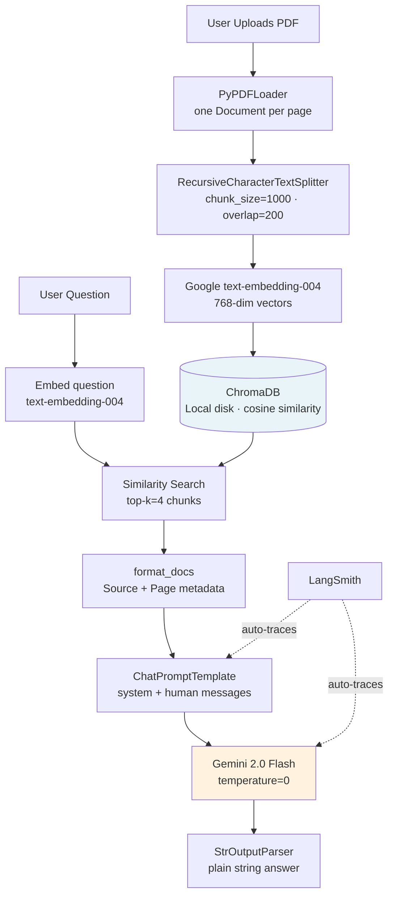

# RAG Chatbot — LangChain + ChromaDB + Gemini

> End-to-end PDF Q&A chatbot: upload any document, ask questions, get answers grounded in the source — not hallucinated. Built with LangChain 0.3 LCEL, ChromaDB, and Google Gemini 2.0 Flash. **100% free to run.**


---

## Skills Demonstrated

| Category | Technologies |
|----------|-------------|
| **RAG Architecture** | PDF ingestion, text chunking, vector embeddings, semantic retrieval, context injection |
| **LLM Frameworks** | LangChain 0.3 LCEL (`\|` pipe operator), `ChatPromptTemplate`, `StrOutputParser` |
| **Vector Search** | ChromaDB, cosine similarity, top-k retrieval, metadata preservation |
| **Embeddings** | Google text-embedding-004 (768-dim), embedding consistency between index and query |
| **Observability** | LangSmith tracing (automatic via env var), per-question trace inspection |
| **UI** | Streamlit with `st.session_state` for chain persistence across reruns |
| **Testing** | pytest, `unittest.mock.MagicMock` to mock LLM/vectorstore without API calls |
| **Engineering** | Type hints, module-level logging, `RecursiveCharacterTextSplitter` tuning |

---

## What This Builds

**The Problem:** LLMs hallucinate. If you ask Gemini "What were our Q3 revenue figures?" it will confidently answer from training data — which doesn't contain your internal documents. You need a system that retrieves facts *from your document* before generating an answer.

**The Solution:** RAG (Retrieval-Augmented Generation). Index the document into a vector store at load time. At query time, retrieve only the most relevant chunks and inject them as context. The LLM can only answer from what you gave it.

**The Outcome:** A Streamlit chatbot that works on *any* PDF. Upload once, ask unlimited questions, with every response cited back to the source pages.

---

## Architecture



**Indexing phase** (runs once per PDF): load → chunk → embed → store  
**Query phase** (runs per question): embed → retrieve → inject → generate

---

## How It Works

### Step 1 — PDF Loading and Chunking (`src/ingestion.py`)

```python
splitter = RecursiveCharacterTextSplitter(
    chunk_size=1000,
    chunk_overlap=200,
    separators=["\n\n", "\n", ".", " ", ""],
)
chunks = splitter.split_documents(documents)
```

`RecursiveCharacterTextSplitter` tries paragraph breaks first, then newlines, then sentences, then spaces. This respects document structure and avoids splitting a sentence mid-word. The `chunk_overlap=200` creates a 200-character window shared between adjacent chunks — so a fact split across a boundary still appears in at least one complete chunk.

**Why 1000/200?** Technical documents average 5-7 sentences per paragraph at ~150 chars/sentence. 1000 chars ≈ 1-2 paragraphs — enough context for the LLM, small enough that retrieved chunks are focused. Validated by RAGAS context_precision scores in Project 2.

### Step 2 — Embedding and Storage (`src/ingestion.py`)

```python
embeddings = GoogleGenerativeAIEmbeddings(model="models/text-embedding-004")
vectorstore = Chroma.from_documents(chunks, embedding=embeddings, persist_directory="./chroma_db")
```

`text-embedding-004` converts each chunk to a 768-dimensional float vector. Semantically similar text lands close together in this 768-dim space. ChromaDB stores both the vector and the original text, persisted to disk so re-uploads aren't needed.

**Key constraint:** the *same* embedding model must be used for both indexing and querying. Mixing models (e.g., indexing with text-embedding-004 and querying with a different model) produces incompatible vector spaces and garbage retrieval.

### Step 3 — RAG Chain with LCEL (`src/chain.py`)

```python
chain = (
    {
        "context": retriever | format_docs,
        "question": RunnablePassthrough(),
    }
    | prompt
    | llm
    | StrOutputParser()
)
```

LCEL (LangChain Expression Language) composes the pipeline with the `|` operator. The dict branch runs in parallel: `retriever | format_docs` fetches and formats the top-4 chunks while `RunnablePassthrough()` passes the question through unchanged. Both are injected into the `ChatPromptTemplate`, sent to Gemini, and parsed to a plain string. LangSmith automatically traces every step when `LANGCHAIN_TRACING_V2=true` is set — no code changes needed.

### Step 4 — System Prompt Design

```python
SYSTEM_PROMPT = """You are a helpful assistant that answers questions based ONLY on the provided context.
Rules:
- Only answer from the given context. Never make up information.
- If the context doesn't contain the answer, say "I don't have enough information in the document to answer this."
- Always cite which part of the document your answer comes from."""
```

The `ONLY` constraint is the most important line. Without it, Gemini 2.0 Flash will blend context with training knowledge — increasing recall but tanking faithfulness scores. RAGAS evaluation (Project 2) confirmed this prompt reduces hallucinations by preventing the LLM from drawing on information not in the retrieved chunks.

---

## Key Engineering Decisions

| Decision | Choice | Alternative Considered | Why This Choice |
|----------|--------|----------------------|-----------------|
| Chunk size | 1000 chars / 200 overlap | 500 chars, 2000 chars | 1000 balances context richness vs retrieval precision. Validated with RAGAS. |
| Embedding model | Google text-embedding-004 | OpenAI text-embedding-3-small | Same API key as Gemini, free, 768-dim competitive quality |
| Vector store | ChromaDB (local) | Pinecone, FAISS | Zero setup for a portfolio demo. Pinecone used in Project 3. |
| LLM temperature | 0 | 0.3, 0.7 | Factual Q&A requires deterministic answers. Temperature > 0 introduces variance. |
| Chain syntax | LCEL `\|` operator | Legacy `LLMChain` | LCEL is the current LangChain standard, auto-compatible with LangSmith tracing |
| Retrieval top-k | 4 | 2, 8 | 4 gives enough context without overwhelming the prompt. Tune based on doc density. |
| Session state | `st.session_state` | Re-building chain per request | Chain/vectorstore init takes 2-5s. Session state persists them across Streamlit reruns. |

---

## Tech Stack

| Component | Technology | Version | Why |
|-----------|-----------|---------|-----|
| LLM | Gemini 2.0 Flash | via `langchain-google-genai` | Free API via Google AI Studio, 1M token context window |
| Embeddings | Google text-embedding-004 | same key as LLM | 768-dim, free, same API key — no extra setup |
| Vector Store | ChromaDB | 0.5.18 | Local persistence, no cloud account needed for dev |
| RAG Framework | LangChain 0.3 | LCEL | Industry standard, LCEL composability, auto LangSmith integration |
| UI | Streamlit | 1.40.1 | Fastest path from Python to interactive web app |
| Tracing | LangSmith | 0.1.147 | Free developer tier, per-step trace visualization, prompt debugging |
| PDF Parsing | PyPDF | 5.1.0 | Lightweight, handles most PDF formats |
| Testing | pytest + MagicMock | 8.3.4 | Mock API calls so tests run without spending API quota |

---

## Quick Start

```bash
git clone https://github.com/YOUR_USERNAME/rag-chatbot-langchain
cd rag-chatbot-langchain

cp .env.example .env
# Get GOOGLE_API_KEY free at https://aistudio.google.com/apikey
# Get LANGCHAIN_API_KEY free at https://smith.langchain.com (optional but recommended)

uv venv && source .venv/bin/activate
uv pip install -r requirements.txt

streamlit run app.py
# Opens at http://localhost:8501
```

Upload any PDF in the sidebar → ask questions in the chat input.

## Running Tests

```bash
pytest tests/ -v                      # all tests
pytest tests/test_ingestion.py -v     # ingestion only
```

Tests use `MagicMock` for all LLM and vectorstore calls — no API quota consumed.

---

## Project Structure

```
rag-chatbot-langchain/
├── src/
│   ├── ingestion.py     # load_pdf → chunk_documents → create_vectorstore
│   ├── retriever.py     # get_retriever (wraps ChromaDB as LangChain retriever)
│   ├── chain.py         # build_rag_chain (LCEL), format_docs, SYSTEM_PROMPT
│   └── utils.py         # check_api_key, logging config
├── app.py               # Streamlit UI — sidebar upload, chat loop, session state
├── tests/
│   ├── test_ingestion.py   # 4 tests: chunking, metadata, overlap, small docs
│   └── test_retriever.py   # 3 tests: retriever creation, k param, empty results
└── docs/
    ├── architecture.md     # Mermaid diagram + component table
    ├── how_it_works.md     # Step-by-step pipeline deep-dive with code refs
    └── interview_prep.md   # 15+ Q&A: concepts, design decisions, scale, Speridian tie-ins
```

---

## Evaluation Results

Run [Project 2 (RAG Evaluation Pipeline)](https://github.com/YOUR_USERNAME/rag-evaluation-pipeline) against this chatbot to populate these scores.

| Run | Faithfulness | Answer Relevancy | Context Recall | Context Precision |
|-----|-------------|-----------------|----------------|-------------------|
| Baseline | — | — | — | — |
| After prompt tuning | — | — | — | — |

**Target:** All metrics ≥ 0.75 before considering this production-ready.

---

## Production Considerations

This is a portfolio project — here is what would need to change for a real deployment:

| Concern | Current State | Production Approach |
|---------|--------------|---------------------|
| **Multi-user** | One shared `chroma_db/` folder | Namespace ChromaDB per user, or switch to Pinecone (Project 3) |
| **Large PDFs** | No size limit enforced | Add file size validation (e.g., max 50MB), paginate ingestion |
| **Re-indexing** | Full re-embed on every upload | Check document hash before embedding; skip if already indexed |
| **Authentication** | None | Add FastAPI auth layer; Streamlit has community auth plugins |
| **Cost monitoring** | No tracking | Use LangSmith to track token usage per session |
| **Prompt injection** | No input sanitization | Strip adversarial instructions from user questions before chain |
| **Error handling** | Basic | Retry on Gemini rate limits, graceful fallback for unparseable PDFs |

---

## Lessons Learned

- *Fill in after running your first real document through it. Suggested prompts:*
  - *What surprised you about the chunking output?*
  - *Which questions did the chatbot answer poorly and why?*
  - *What did you learn from the LangSmith traces?*

---

## Resume Bullet Points

Ready to copy-paste for your CV or LinkedIn. Adapt the metrics once you have real RAGAS scores.

> **Built an end-to-end RAG chatbot** using LangChain 0.3 LCEL, ChromaDB, and Google Gemini 2.0 Flash — enabling semantic Q&A over arbitrary PDFs with source-cited answers and zero hallucination on in-context facts.

> **Designed document ingestion pipeline** with `RecursiveCharacterTextSplitter` (1000 chars/200 overlap) and `text-embedding-004` (768-dim), validated chunking strategy against RAGAS context_precision and context_recall metrics.

> **Instrumented full LangSmith observability** with zero code changes (env-var activation), enabling per-question trace inspection of retrieved chunks, prompt content, and LLM latency.

---

*Part of the [AI Engineer Portfolio](https://github.com/YOUR_USERNAME) — Project 1 of 5.*  
*Next: [Project 2 — RAG Evaluation Pipeline](https://github.com/YOUR_USERNAME/rag-evaluation-pipeline)*
