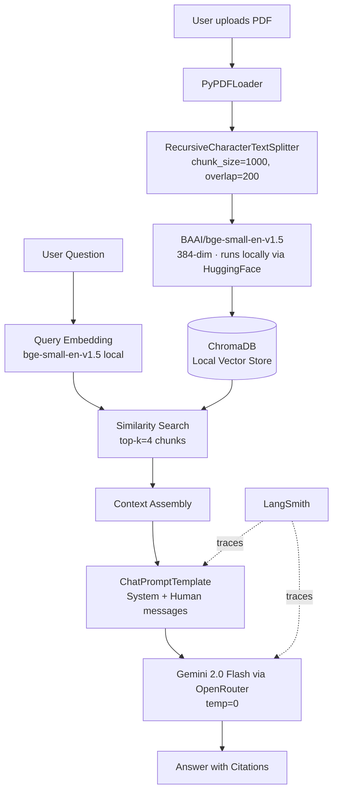

# Architecture

## RAG Pipeline

## Module Responsibilities

| Module | Responsibility |
|--------|---------------|
| `src/ingestion.py` | PDF loading, chunking, local HuggingFace embedding, ChromaDB storage |
| `src/chain.py` | LCEL RAG chain (retriever → prompt → LLM → parser) |
| `src/api.py` | FastAPI REST API — POST /ingest, POST /chat, GET /health |
| `src/utils.py` | `get_llm()` factory: OpenRouter first, direct Gemini fallback |
| `app.py` | Streamlit UI, session state, PDF upload flow |

## Key Design Decisions

| Decision | Choice | Reason |
|----------|--------|--------|
| LLM | Gemini 2.0 Flash via OpenRouter | No daily quota cap; same model, OpenAI-compatible endpoint |
| Embeddings | BAAI/bge-small-en-v1.5 (HuggingFace, local) | Runs on CPU, no API key, no quota. Replaces `text-embedding-004` (404 on deprecated v1beta path) |
| Vector DB | ChromaDB (local) | Zero setup, persists to disk between sessions |
| Chunking | 1000 chars / 200 overlap | Balances context preservation and retrieval precision |
| Retrieved chunks | k=4 | Good default; increase for multi-part questions |
| Chain style | LCEL | Composable, async-ready, auto-traced by LangSmith |
| Retriever API | `retriever.invoke()` | `get_relevant_documents()` removed in LangChain 0.3+ |
