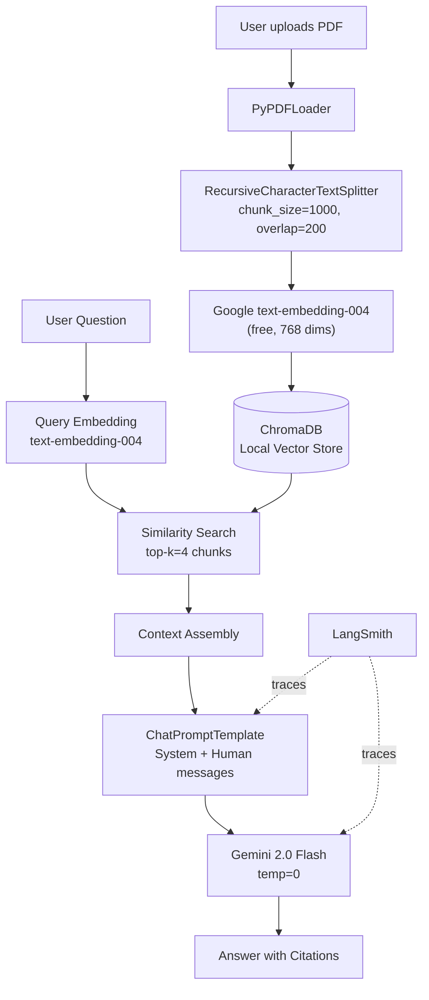

# Architecture

## RAG Pipeline

## Module Responsibilities

| Module | Responsibility |
|--------|---------------|
| `src/ingestion.py` | PDF loading, chunking, embedding, ChromaDB storage |
| `src/retriever.py` | Similarity search wrappers |
| `src/chain.py` | LCEL RAG chain (retriever → prompt → LLM → parser) |
| `src/utils.py` | Logging setup, directory helpers, API key validation |
| `app.py` | Streamlit UI, session state, PDF upload flow |

## Key Design Decisions

| Decision | Choice | Reason |
|----------|--------|--------|
| LLM | Gemini 2.0 Flash | Free tier, 1M token context window, fast |
| Embeddings | text-embedding-004 | Same API key as LLM, 768 dims, strong retrieval quality |
| Vector DB | ChromaDB (local) | Zero setup, persists to disk between sessions |
| Chunking | 1000 chars / 200 overlap | Balances context preservation and retrieval precision |
| Retrieved chunks | k=4 | Good default; increase for multi-part questions |
| Chain style | LCEL | Composable, async-ready, auto-traced by LangSmith |
